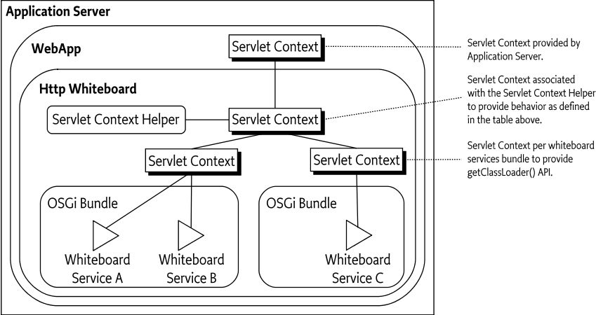

////
    Copyright 2021 OPS4J.

    Licensed under the Apache License, Version 2.0 (the "License");
    you may not use this file except in compliance with the License.
    You may obtain a copy of the License at

        http://www.apache.org/licenses/LICENSE-2.0

    Unless required by applicable law or agreed to in writing, software
    distributed under the License is distributed on an "AS IS" BASIS,
    WITHOUT WARRANTIES OR CONDITIONS OF ANY KIND, either express or implied.
    See the License for the specific language governing permissions and
    limitations under the License.
////

= Pax Web Developers Guide
:doctype: book
:reproducible:
:toc: left

This document explains design choices and the architecture of the Pax Web itself. You'll also find some information about how Pax Web evolved - especially when justifying some changes made in Pax Web 8.

== Model

Pax Web 8 contains a rewritten and refactored _model_ of:

* web contexts
* web elements (servlets, filters, listeners, error pages, welcome files, ...)

While web elements are quite easy to understand - the relevant classes from `org.ops4j.pax.web.service.spi.model.elements` package, for example `org.ops4j.pax.web.service.spi.model.elements.ServletModel` simply contain everything that constitute given web element, it's not that easy with _web contexts_.

Before Pax Web 8, there was only `org.ops4j.pax.web.service.spi.model.ContextModel` representing a _context_. To understand the changes made in Pax Web 8, let's dive into _contexts_.

== Contexts

A _context_ is the most important concept in Pax Web. There are at least 3 different _contexts_ used across entire Pax Web and the supported runtimes.

Let's start with this image from chapter 140.2.7 "Relation to the Servlet Container" of OSGi CMPN specification:

Here's a quick summary of the three types of _contexts_:

1. An implementation of `javax.servlet.ServletContext` provided by target runtime (Jetty, Tomcat and Undertow)
2. An implementation of either `org.osgi.service.http.HttpContext` or `org.osgi.service.http.context.ServletContextHelper` which user passes to `org.osgi.service.http.HttpService` or registers as Whiteboard OSGi service
3. An implementation of `javax.servlet.ServletContext` that bridges the two above together.

(It's obvious that I don't mention `org.osgi.framework.BundleContext` as one of the _contexts_ described here).

Before Pax Web 8 there was a fundamental issue with the model of a _context_ - it wasn't explicitly modeled as N:1 relation where needed.

This problem is more visible when reading chapter https://docs.osgi.org/specification/osgi.cmpn/7.0.0/service.http.whiteboard.html#service.http.whiteboard.common.properties[140.3 Common Whiteboard Properties] of the OSGi CMPN specification:

[quote]
Whiteboard servlet, servlet filter, resource and listener services support common service registration properties to associate them with a ServletContextHelper and/or a Http Whiteboard implementation.

The point is that when user reqisters for example a `javax.servlet.Servlet` OSGi service, this service registration property can be used:

[listing]
----
osgi.http.whiteboard.context.select = (osgi.http.whiteboard.context.name=*)
----

This simple rule is both powerful and game-changing (when talking about Pax Web before version 8). It means that a single servlet can be registered to *many* contexts. Period. It literally means that single registered `javax.servlet.Servlet` with e.g., `/my-servlet` mapping may be accessible under many URLs:

* \http://localhost:8181/my-servlet
* \http://localhost:8181/my-context1/my-servlet
* \http://localhost:8181/.../my-servlet

This simple _discovery_ of mine lead to the refactoring effort of entire Pax Web.

Let's now check all the mentioned types of contexts.

=== Runtime specific contexts

These are quite simple - they literally represent a _servlet context_ specific to given target runtime (Jetty, Tomcat, Undertow) and are distinguished by _context path_. They are in relation 1:1 with the _context path_.

* Jetty: `org.eclipse.jetty.servlet.ServletContextHandler.Context` (and few others)
* Tomcat: `org.apache.catalina.core.ApplicationContext`
* Undertow: `io.undertow.servlet.spec.ServletContextImpl`

These implementation classes are always visible to developer (and web applications) through `javax.servlet.ServletContext` interface.

For completeness, these implementations are always backed by more specific _context_ provided by target runtime which manages the lifecycle and registration of _web elements_ these are:

* Jetty: `org.eclipse.jetty.server.handler.ContextHandler` (and subclasses)
* Tomcat: `org.apache.catalina.core.StandardContext`
* Undertow: combination of `io.undertow.servlet.api.DeploymentInfo`, `io.undertow.servlet.api.DeploymentManager` and `io.undertow.servlet.api.Deployment`

At Pax Web level, this type of context is represented by `org.ops4j.pax.web.service.spi.model.ServletContextModel`.

=== User specific contexts

=== Bridging contexts

== Lifecycle of a context

* by user when passing to `HttpService.registerXXX()`
* by user when registering a `ServletContextHelper` OSGi service
* by Pax Web WAR Extender when deploying a WAB to the runtime

It is important to be aware how it translates to real context managed by target runtime.

== Resources

From the perspective of JavaEE web developer, the proper interface to access web resources is `javax.servlet.ServletContext` and its resource accessing methods:

* `javax.servlet.ServletContext.getResourcePaths` - a directory listing for entries beginning with the passed argument which is a _base_. The _base_ is a directory directly stored in a WAR, but also a path inside _all_ the `/WEB-INF/lib/\*.jar!/META-INF/resources/`. This method returns _names_ and doesn't restrict access to `/WEB-INF` directory!
* `javax.servlet.ServletContext.getResource[AsStream]` - this method returns a URL (a stream from it). Passed argument _must_ start with `/` and is a base inside a WAR or a base of each of the `/WEB-INF/lib/\*.jar!/META-INF/resources/`. According to JavaDoc, this method doesn't involve classloaders. Also this method doesn't prevent accessing `/WEB-INF/` or `/META-INF`!
* `javax.servlet.ServletContext.getRealPath` - used to translate request URI to a real location of a file mapped by given URI. This is only useful within the context of default (resource) servlet and even Servlet specification says that resource paths from `/META-INF/resources` of embedded JARs should be returned only if the JARs are unpacked - this is even less likely in an OSGi environment (with fragments, bundles, etc.).

We can skip `getRealPath` method which actually doesn't make any sense in an OSGi environment.

And `getResource[AsStream]` and `getResourcePaths` do not have protection mechanism (to skip `/WEB-INF` or `/META-INF` directories) because many frameworks (like JSF or JSP) need access to these directories.

From the perspective of OSGi web developer, `javax.servlet.ServletContext` is not the only interface that can be used. There are also:

* (from chapter 102, "Http Service specification"): `org.osgi.service.http.HttpContext`
* (from chapter 140, "Whiteboard specification"): `org.osgi.service.http.context.ServletContextHelper`
* (from chapter 128, "Web Applications specification", 128.3.5 Static Content and 128.6.3 Resource Lookup): no new interface is introduced, but this is stated:
[quote]
The getResource and getResourceAsStream methods of the ServletContext interface are used to access resources in the web application. For a WAB, these resources must be found according to the findEntries method, this method includes fragments. For the getResource and getResourceAsStream method, if multiple resources are found, then the first one must be used.

Only chapter "128.3.5 Static Content" mentions about the protection of `WEB-INF/`, `OSGI-INF/`, `META-INF/` and `OSGI-OPT/` directories. But because we _can't_ filter them out when calling any resource access methods, the only place we can prevent access to these entries is the default servlet (used to serve the resources and usually mapped to `/`).

So no protection is implemented in `javax.servlet.ServletContext` implementations and in any implementation of `org.osgi.service.http.HttpService` or `org.osgi.service.http.context.ServletContextHelper`.

Actual runtimes have their own protection mechanisms:

* Tomcat denies HTTP access to these directories as soon as in `org.apache.catalina.core.StandardContextValve.invoke()`
* Jetty allows configuration of protected directories in `org.eclipse.jetty.server.handler.ContextHandler._protectedTargets`
* Undertow does it in just-enough time in `io.undertow.servlet.handlers.DefaultServlet.doGet()`. Some paths are checked in `io.undertow.servlet.handlers.ServletInitialHandler.handleRequest()` (only exact `/META-INF/` and `/WEB-INF` prefixed paths).